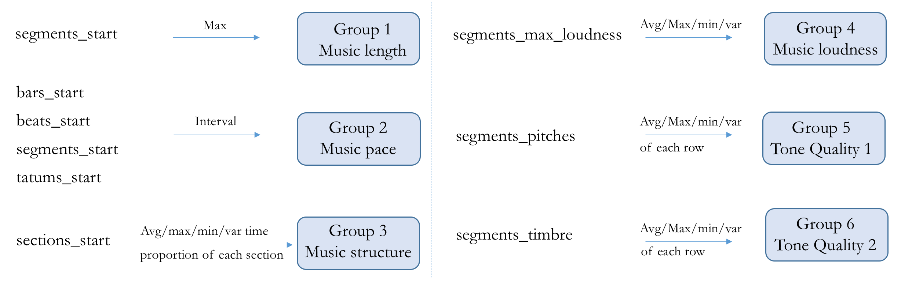
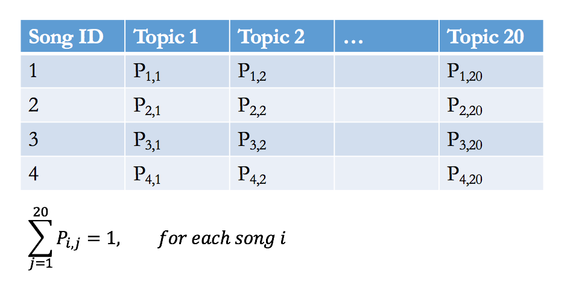

# Project: Words 4 Music

### [1. Project Description](doc/project4_desc.md)


Term: Fall 2016

+ [Data link](https://courseworks2.columbia.edu/courses/11849/files/folder/Project_Files?preview=763391)-(coursework login required)
+ [Data description](doc/readme.html)
+ Contributor's name: Yaqing Xie
+ Collaboration and discussion with: Yueqi Zhang, Tian Sheng, Qing Yin, Sen Zhuang
+ Projec title: Words 4 Music
+ Project summary: The objective of this project is to recommend candidate lyrics to songs given their music features. Word frequency in lyrics as well as music features of the training songs are provided. For test songs, only music features are available. Two different methodologies are applied in this project.

### 2. Association Rule
* For each training song, based on its raw features, **calculate and categorize** the statistics including:
  + GROUP 1-music length: max segment start time -> duration
  + GROUP 2-music pace: beat interval, bar interval, segment interval and tatums interval
  + GROUP 3-music structure: number of sections, avg/max/min/var time proportion of each section
  + GROUP 4-music loudness: mean/max/bin/var value of max loudness
  + GROUP 5-tone quality 1: avg/max/min/var value of each row in the pitches matrix
  + GROUP 6-tone quality 2: avg/max/min/var value of each row in the timbre matrix <br />
   <br />
  
* In order to transfer the obtained features into factor data type, do K-means clustering on each feature group.
* Use **topic modeling** to assign training songs with different topics.
* Use **association rule** to understand how features associate with topics.
* Sample output: <br />
   <br />
  Following the steps above, the output suggests that the most informative features among Topic 1 songs are pitches and timbre.

### 3. Lyric Prediction
* **Extract** all raw features of training songs from h5 files. 
* Considering different songs have different dimensions of features, for each feature, calculate the *median* number of dimensions first, and then either truncate of append the feature so the dimension can be consistent among different songs. <br />
   <br />
* Use **topic modeling** to assign training songs with different topics.
* For each topic of songs, calculate the vocabulary probability distribution.
* Use **KNN or RF** to predict a new test song's topic based on its features.<br />
   <br />
* After a test song is given a topic, recommend the lyrics that are of the highest probability in the vocabulary of this topic.


Following [suggestions](http://nicercode.github.io/blog/2013-04-05-projects/) by [RICH FITZJOHN](http://nicercode.github.io/about/#Team) (@richfitz). This folder is orgarnized as follows.


```
proj/
├── lib/
├── data/
├── doc/
├── figs/
└── output/
```

Please see each subfolder for a README file.
